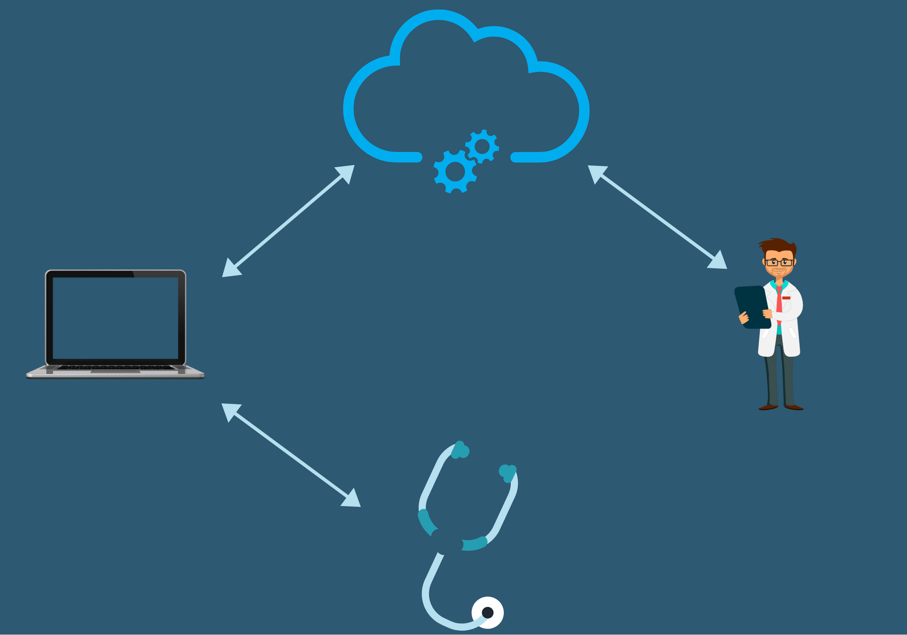

# Remote Medical Diagnostics System

---

## Team
-  E/17/134, Kavindu Jayasooriya, [email](mailto:e17134@eng.pdn.ac.lk)
-  E/17/318, Udith Senanayake, [email](mailto:e17318@eng.pdn.ac.lk)
-  E/17/207, Pasindu Marasinghe, [email](mailto:e17207@eng.pdn.ac.lk)

## Table of Contents
1. [Introduction](#introduction)
2. [Solution Architecture](#solution-architecture )
3. [Hardware & Software Designs](#hardware-and-software-designs)
4. [Testing](#testing)
5. [Detailed budget](#detailed-budget)
6. [Conclusion](#conclusion)
7. [Links](#links)

---

## Introduction

People have to face a lot of challenges when they want to see a doctor, from having to waste time on the road full of traffic, waiting in long queues for hours to being in hospitals full of patients with contagious diseases. We aim to minimize these problems by introducing a platform where doctors and patients can meet online and a convenient diagnostics device to go with it; eliminating the need to go to a hospital for most of the common medical conditions and get diagnosed in the comfort of your own home.

While there are some solutions already available in the market trying to solve some of these  problems like E-channeling, audio and video conferencing they don't provide a good way for the doctor to monitor the patient's condition easily. We aim to design a cheap yet convenient and effective tool to make everybody's life easier by taking patient’s measurements in real time.

What's available in the system:
    * Making appointments online 
    * Video Consultation.
    * Diagnostics device that reads commonly needed measurements
        -Heartbeat sensing (clear audio with little to no background  noise)
        -Temperature  sensing ( 5&deg;C tolerance)
    * Ability to handle the device via software and hardware
    * Real-Time  measurements.   
    * Getting valid prescriptions from the doctor	    
    * Verified authenticity of the doctor
    * Privacy and Confidentiality
    * Patient history and other analytics
    * User experiences and reviews for a doctor

## Solution Architecture

## Hardware and Software Designs

Detailed designs with many sub-sections

## Testing

Testing done on hardware and software, detailed + summarized results

## Detailed budget

All items and costs

| Item          | Quantity  | Unit Cost  | Total  |
| ------------- |:---------:|:----------:|-------:|
| ATmega328P | 1         | 600 LKR     | 600 LKR |
| LM35 Temperature Sensor   | 1         | 110 LKR     | 110 LKR |

## Conclusion

What was achieved:

Future developments:
    Getting drugs delivered to the patients house.

Commercialization plans:
    Make the device free for the first coutomers who uses the system. 

## Links

- [Project Repository](https://github.com/cepdnaclk/{{ page.repository-name }}){:target="_blank"}
- [Project Page](https://cepdnaclk.github.io/{{ page.repository-name}}){:target="_blank"}
- [Department of Computer Engineering](http://www.ce.pdn.ac.lk/)
- [University of Peradeniya](https://eng.pdn.ac.lk/)
