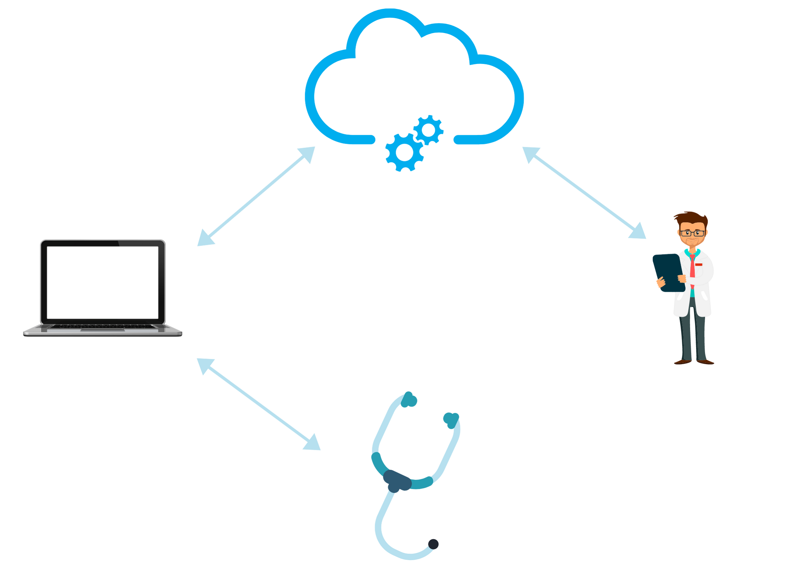
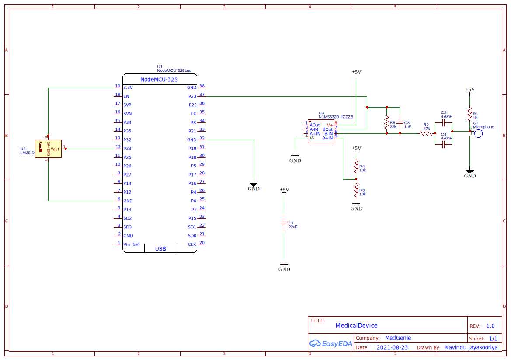
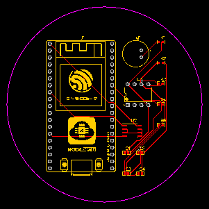
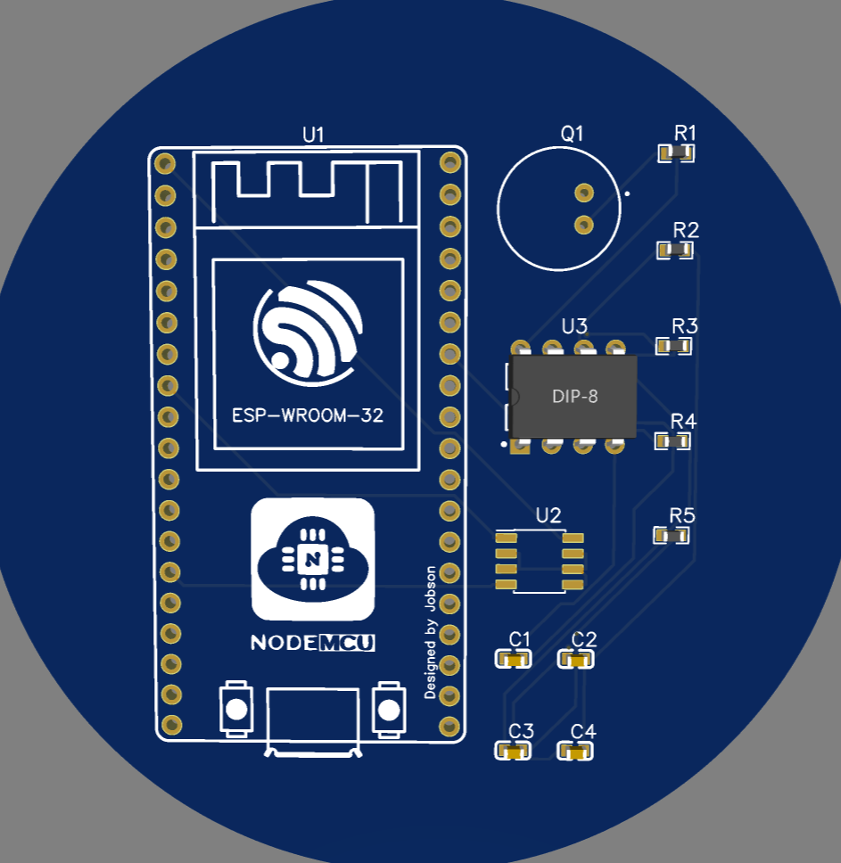
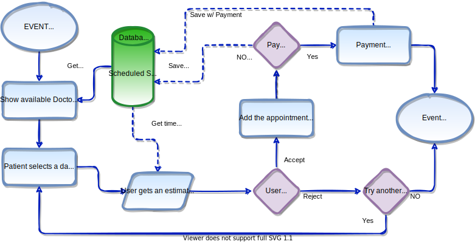
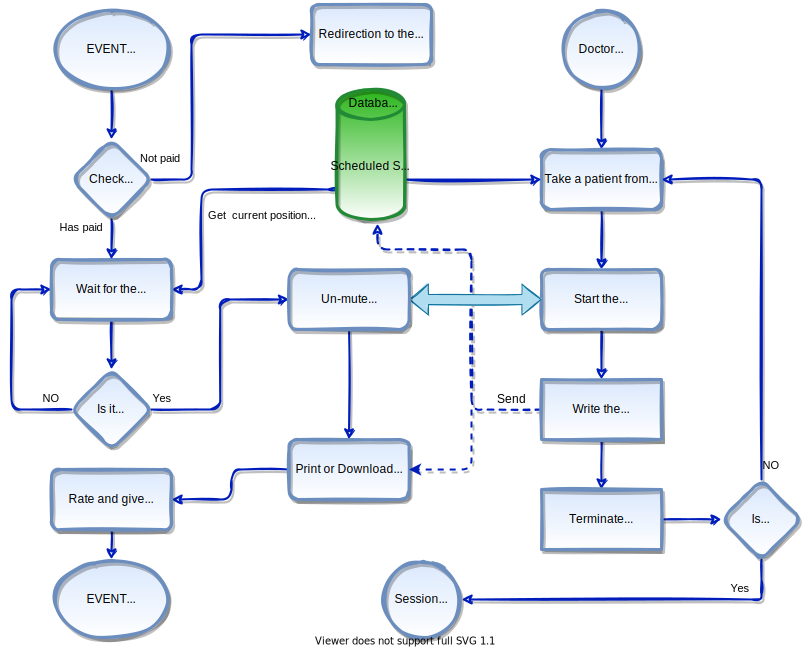
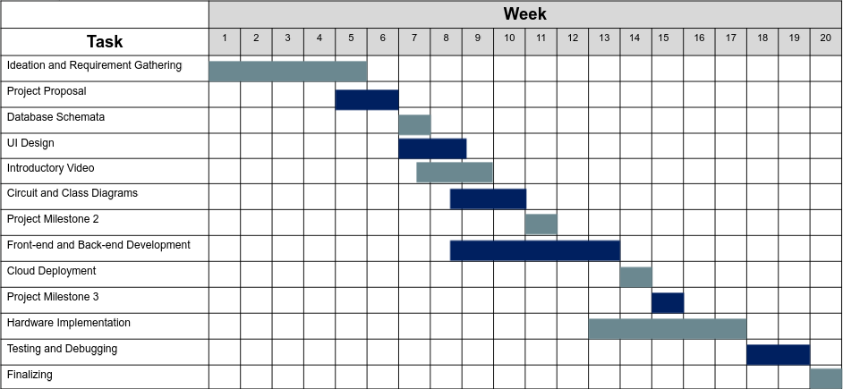

# Remote Medical Diagnostics System

---

## Team

- E/17/134, Kavindu Jayasooriya, [e17134@eng.pdn.ac.lk](mailto:e17134@eng.pdn.ac.lk)
- E/17/318, Udith Senanayake, [e17318@eng.pdn.ac.lk](mailto:e17318@eng.pdn.ac.lk)
- E/17/207, Pasindu Marasinghe, [e17207@eng.pdn.ac.lk](mailto:e17207@eng.pdn.ac.lk)

## Table of Contents

1. [Introduction](#introduction)

2. [Solution Architecture](#solution-architecture)

3. [Hardware & Software Designs](#hardware-and-software-designs)

   - [Hardware Components](#hardware-components)
   - [Circuit Designs](#circuit-designs)
   - [Software Tools](#software-tools)
   - [UI Designs](#ui-designs)
   - [3D Prototypes](#3d-prototype)

4. [Algorithms](#algorithms)

5. [Testing](#testing)

   - [Hardware](#hardware-testing)
   - [Software](#software-testing)

6. [Detailed budget (tentative)](#detailed-budget)

7. [Project Timeline](#project-timeline)

8. [Conclusion (will be available after testing)](#conclusion)

9. [Supervisors](#supervisors)

10. [Links](#links)

---

## Introduction

<iframe class="embed-responsive-item" width="560" height="315" src="https://www.youtube.com/embed/ErDjIRsoetE" title="YouTube video player" frameborder="0" allow="accelerometer; autoplay; clipboard-write; encrypted-media; gyroscope; picture-in-picture" allowfullscreen> </iframe>

  
  
  
People have to face a lot of challenges when they want to see a doctor, from having to waste time on the road full of traffic, waiting in long queues for hours to being in hospitals full of patients with contagious diseases. We aim to minimize these problems by introducing a platform where doctors and patients can meet online and a convenient diagnostics device to go with it; eliminating the need to go to a hospital for most of the common medical conditions and get diagnosed in the comfort of your own home.

While there are some solutions already available in the market trying to solve some of these problems like E-channeling, audio and video conferencing they don't provide a good way for the doctor to monitor the patient's condition easily. We aim to design a cheap yet convenient and effective tool to make everybody's life easier by taking patient’s measurements in real-time.

What's available in the system:

- Making appointments online
- Video Consultation.
- Diagnostics device that reads commonly needed measurements
  - Heartbeat sensing (clear audio with little to no background noise)
  - Temperature sensing ( 0.5&deg;C tolerance)
  - Glucose levels in the blood
  - Blood pressure
- Ability to handle the device via software and hardware
- Real-Time measurements.
- Getting valid prescriptions from the doctor
- Verified authenticity of the doctor
- Privacy and Confidentiality
- Patient history and other analytics
- User experiences and reviews for a doctor

### Who is it for?

As an individual patient one simply have to sign up and log on to our system to meet verified doctors with audio conferencing; for a more accurate diagnosis, our medical device can be used. Hospitals can use our system to manage doctor-patient communication remotely by getting the platform set up along with their existing systems. Individual doctors can use our system by going through a verification process that assesses the validity of their license to practice medicine ( Doctors, patients who are associated with a hospital that uses our system can directly use this platform )

## Solution Architecture

&nbsp;

<!-- non-breaking space ASCII character (to insert a newline)-->

This diagram shows how components in our system connect with each other. The device that assists the diagnostics takes two main measurements; heart/lung sounds and temperature. Support for additional peripherals that are used to measure glucose levels in the blood, blood pressure is available. These are the information a doctor usually takes to diagnose a patient initially, most of the medical centers do not have complex and expensive machinery with them unless it is a fully-fledged hospital that treats inpatients. This is because they are not needed for most of the common sicknesses that patients take medicine every day. Our device takes these common measurements, therefore, saves the vast majority of hospital trips people need to take. There is some portion of diseases that require laboratory test results and inner body images which our device does not support. But for reviewing those lab results and blood works this system can be used easily. 
&nbsp;

The online platform provides userfriendly interfaces that include the following functionality for each user type:

- For a doctor:

  - Schedule Sessions
  - Interact with the Patient
  - See Patient’s Medical History
  - Make Notes
  - Write the Prescription
  - Control the Device

- For a patient:
  - Make Appointments
  - Interact with the Doctor
  - Make Payments
  - Obtain the Prescription
  - Get Notified About the Appointments
  - Rate and Give Feedback to the Doctor

Information about patients like their medical history, NCDs (non-communicable diseases: heart disease, stroke, cancer, diabetes, and chronic lung disease), allergies to medication (Penicillin and related antibiotics, Antibiotics containing sulfonamides (sulfa drugs), Anticonvulsants, Aspirin, ibuprofen and other nonsteroidal anti-inflammatory drugs (NSAIDs), Chemotherapy drugs) or food and lifestyle are going to be stored and made available to the doctor who treats that particular patient; this can be useful for the diagnostician and is not usually accommodated in the conventional way of seeing a doctor.  
&nbsp;
About the doctors, information about their medical license, specialty, and available times are stored and shown to the users. Functionality for reviewing and feedback is also planned to be implemented.
&nbsp;

Apart from the information about the users, scheduling times, metadata, and statistics will be stored.
&nbsp;

## Hardware and Software Designs

## 3D Prototype

<iframe class="embed-responsive-item" width="560" height="315" src="https://www.youtube.com/embed/-WBMsB9ggEM" title="YouTube video player" frameborder="0" allow="accelerometer; autoplay; clipboard-write; encrypted-media; gyroscope; picture-in-picture" allowfullscreen> </iframe>

The device is completely wireless, WiFi is used to do data communication (can connect with a smartphone/computer without manual configuration).&nbsp;

Powered with Li-ion rechargeable batteries. There are two inbuilt sensors; a temperature sensor and a microphone (stethoscope). &nbsp;

The microphone is controlled by the doctor over the internet. (microcontroller is signaled to initiate reading and transmitting data)&nbsp;

The temperature sensor is activated when pressed against the skin. (continuous measurements are not needed)
&nbsp;

An on/off switch is available to power down the device
&nbsp;

### Hardware Components

- **esp32**

  - Relatively high sampling rate
  - 12 bit ADC bit depth
  - Wifi capabilities

- **LM35 Temperature Sensor**

  - 0.5°C typical accuracy
  - Low-Cost
  - Linear scale
  - Calibrated Directly in Celsius
  - Less Than 60-μA Current Drain
  - 4V - 30V (operating voltage)

- **Amplifier**
  - To increase signal-to-noise ratio and also as a unity gain buffer
  - Features excellent power supply rejection ratio (112 dB)
  - Excellent common-mode rejection ratio (126 dB)

### Circuit Designs

The following diagrams show the proposed designs for the prototype device:

- **Schematic Diagram**
  
  LM53: temprature sensor
  &nbsp;  
   CAO106: electret condenser microphone
  &nbsp;  
   NJM5532: low noise operational amplifier
  &nbsp;
- **PCB Layout**

  

- **3D Circuit Model**
  

- **Design Decisions**
  - I2C interface is utilized to allow connectivity for most of the common sphygmomanometers (blood pressure monitors)
  - The built-in capacitive touch sensor capability is used to trigger the temperature sensor
  - A bandpass filter is used to filter out the unwanted frequencies
  - The low pass filter is set to lower frequencies than usual to better suit internal body sounds

### Software Tools and Technologies

- **React**
  - Virtual DOM feature that allows rendering only the changed UI components (avoiding simple changes at the top level from causing huge ripples to the user interface)
  - Provide high performance making complex apps run extremely fast
- **Node.js**

  - Load balancing and the capability to handle a huge number of concurrent connections
  - Possible to create a separate microservice for any functionality
  - Data is divided into small chunks that are sent to the front end piece by piece (Good for video conferencing)

- **AWS**
  - Highly scalable
  - Flexible in choosing OS, programming languages, database, and other services
  - The pay-as-you-go pricing (pay only for the exact amount of resources used)
- **MongoDB**
  - A non-relational database that is favorable to the data in the system.
  - It is a natural form to store data (human-readable)
  - Structured and unstructured information can be stored in the same document
  - Dynamic schema; adding fields or leaving a field out is possible

## UI Designs

Click [here](./ui_designs.md) to see all UIs.

### UI Prototypes

#### Patient's UIs

<iframe class="embed-responsive-item" width="800" height="450" src="https://www.figma.com/embed?embed_host=share&url=https%3A%2F%2Fwww.figma.com%2Fproto%2FloRkV7q0OmFPF1GQE8CiwB%2FMedGenie_Prototypes-patient%3Fnode-id%3D866%253A13%26scaling%3Dcontain%26page-id%3D1%253A2%26starting-point-node-id%3D866%253A13" title="figma mockup" frameborder="0" allow="accelerometer; autoplay; clipboard-write; encrypted-media; gyroscope; picture-in-picture" allowfullscreen> </iframe>

#### Doctor's UIs

<iframe class="embed-responsive-item" width="800" height="450" src="https://www.figma.com/embed?embed_host=share&url=https%3A%2F%2Fwww.figma.com%2Fproto%2FczeRaUU8YfMwATRqlCa1lW%2FMedGenie-Copy%3Fnode-id%3D507%253A15%26scaling%3Dcontain%26page-id%3D1%253A2%26starting-point-node-id%3D507%253A15" title="figma mockup" frameborder="0" allow="accelerometer; autoplay; clipboard-write; encrypted-media; gyroscope; picture-in-picture" allowfullscreen> </iframe>

## Algorithms

- When a patient adds an appointment
  
- When patients join a session
  

## Testing

### Hardware Testing

Prototypes with different hardware implementations are planned to be used to test the system. Data generated by our device will be compared against freely available heart/lung sounds measured by the state of the art equipment.

### Software Testing

- Importance of test-driven development (TDD)

  With TDD we identify the bugs right in the development stage. It is impossible to test each component manually when the project grows. And if done by hand it would cost
  a lot of time.

- Unit Tests

  The idea behind Unit Testing is to test every single part of the program separately and show that the individual parts are correct. In unit testing, we test the business logic of a function or a component. The number of test cases for a unit will depend on all the different execution paths.  
  For front-end unit testing, we render component trees in a simplified test environment and assert their output

- Integration tests

  The idea behind Integration testing is to combine small units in the application and test as a group to see that
  they are working fine together.
  Integration tests involve database queries and network requests most of the time.  
  We use integration tests to prevent bugs from reaching the production stage.

- End to end tests

  The main purpose of End-to-end (E2E) testing is to test from the end user’s experience by simulating
  the real user scenario and validating the system under test and its components for integration and data integrity.  
   We use the selenium framework to test the web application.

- Tests in this project

  We have automated unit tests and integration tests using Github workflows. This helps us to refactor with confidence
  and make sure that new pull requests pass all the test cases before they are merged into the main branch.

  - [Front-end related tests](https://github.com/cepdnaclk/e17-3yp-remote-medical-diagnostics/tree/main/src/front-end/src/tests)
  - [Back-end related tests](https://github.com/cepdnaclk/e17-3yp-remote-medical-diagnostics/tree/main/src/back-end/src/tests)
  - [End-to-end tests](https://github.com/cepdnaclk/e17-3yp-remote-medical-diagnostics/tree/main/tests)

## Detailed budget

All items and costs according to the current plan: (might change in the future)

| Item                             | Quantity | Unit Cost (Rs.) | Total (Rs.) |
| -------------------------------- | :------: | :-------------: | ----------: |
| ESP32                            |    1     |      1500       |        1500 |
| LM35 Temperature Sensor          |    1     |       110       |         110 |
| 3.7V Li-ion Rechargeable Battery |    2     |       200       |         400 |
| Max17048 Cell Fuel Gauge         |    1     |       500       |         500 |
| AMS1117-3.3 Voltage Regulator    |    1     |        10       |          10 |
| Logic Level Converter            |    1     |       135       |         135 |
| Condenser mic CA0106             |    1     |        20       |          20 |
| Stethoscope                      |    1     |       840       |         840 |
| Others                           |          |                 |        2000 |
|                                  |          |      TOTAL      |        5515 |

## Project Timeline

## Supervisors

- Dr.Isuru Nawinne [web page](http://www.ce.pdn.ac.lk/academic-staff/isuru-nawinne/)
- Dr.Mahanama Wickramasinghe [web page](http://www.ce.pdn.ac.lk/2021/05/02/dr-mahanama-wickramasinghe/)

## Conclusion

<!--
What was achieved:

Future developments:
    Getting drugs delivered to the patient's house.

Commercialization plans:
    Make the device free for the first customers who use the system.  -->

## Links

- [Project Repository](https://github.com/cepdnaclk/e17-3yp-remote-medical-diagnostics)
- [Project Page](https://cepdnaclk.github.io/e17-3yp-remote-medical-diagnostics/)
- [Survey Results](https://docs.google.com/forms/d/1sDb781OPwRVMzDbYPuDZniuY1GsKrwd6tm7-NLvUVZU/viewanalytics)
- [Department of Computer Engineering](http://www.ce.pdn.ac.lk/)
- [University of Peradeniya](https://eng.pdn.ac.lk/)
