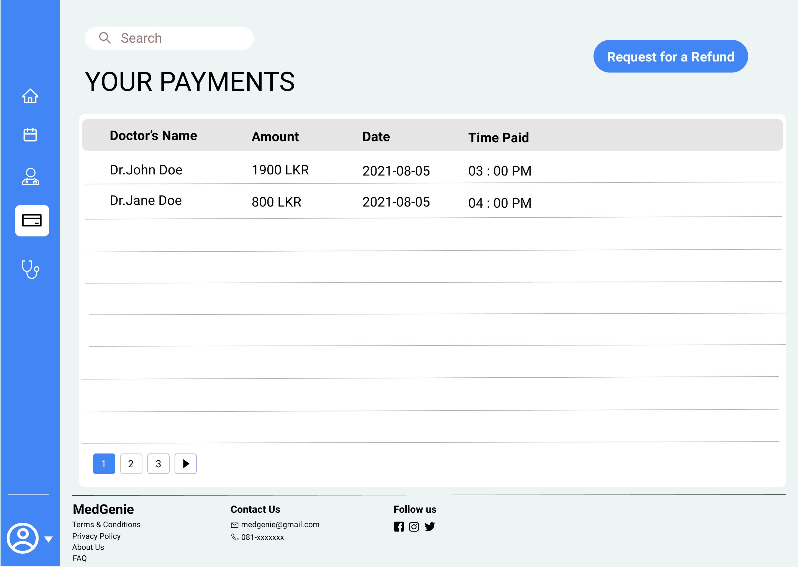

# User Interfaces
## Patient's UIs

This is the login page of the web application. The patient can either log in from here or sign up by clicking on 'Create Account'

---

A patient can create an account here by filling out the form or can directly sign up using a Google Account.

---

This is the home page of the user profile. The patient can search for a doctor and make an appointment using the search box. The sidebar can be used to nagivate to Appointments, Doctors and Payments. Also the user can access the User Profile page by clicking on the username.

---

This is where all the appointments made by a patient are displayed. A patient can choose either to pay or delete an appointment. A patient should pay for the meeting before the meeting in order for the permission to join the meeting to be granted. The patient has the option to cancel the appointment only before making a payment and if somebody who paid could not make it to the meeting has the option to request for a refund as well.

---

This is where all the doctors in the centre is displayed. Clicking on a doctor's name will allow a patient to have a look at more details of a doctor. The doctors are ordered according to their ratings given by patients after each session. The patient has the option to search for a doctor as in the homepage or can directly make an appointment by clicking on the (+) button at the end of an entry.

---

A patient can see all the payments made in the 'Payments' page. A request for a refund can be done from here.

---

This is where a patient can update profile details, user settings etc.

---

This is what a patient experiences in a meeting with a doctor. The patient can download the prescription that the doctor issues as either an image or in pdf format.

---
## Doctor's UIs

This is the homepage for a doctor. A doctor can create and schedule a session here so that the patients can make appointments. The remaining time for the next session of a doctor is also displayed in the homepage and the doctor can start the session by clicking on 'Start Session'.

---

All the sessions that a doctor schedules is listed here and a session can be started from here too. A doctor has the option to create a session from here as well.

---

A doctor can access the profile page from the sidebar. Updating the profile details, account setting, etc. can be done from here.

---

This is how a video conference looks like in the doctor's perspective. The doctor can see the list of the patients in the queue and the doctor can only admit the next person in the queue. If that patient doesnt seem to respond, the doctor can discard the patient putting the patient at the bottom of the queue.

---

A doctor can access the medical device of the patient from here. The body temperature is displayed at the top and the doctor can start listening to the heart sounds by clicking on the 'Start Listening' button. The doctor also has the option to replay and listen to the obtained audio data.

---
